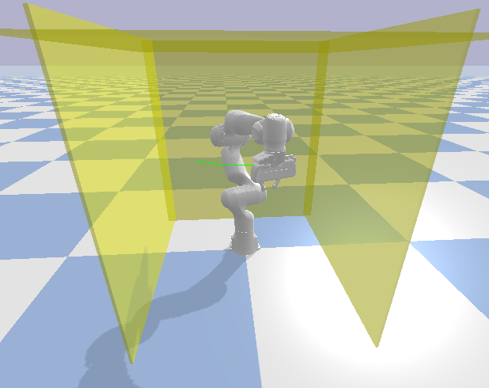

# Robot Arm Planning, TODO...
<!-- # Sampling-based Planning for Robot Arm -->

These code are modified basd on [Sampling-based Planning for Robot Arm](https://github.com/aaronzguan/Sampling-based-Planning-for-Robot-Arm)

Do not require ROS !!!

2. `python main.py`

3. Install all requirements.

   `pip install -r requirements.txt`

4. Change the path argument in visualize.launch to the path to your working folder.

5. Run the RRT planner:

   Run the CBIRRT planner:

   Run the PRM planner:

   If reusing the graph created before:

   `python3 plan.py --prm [--map2/map3]--reuse_graph`

   Run the OBPRM planner:

   `python3 plan.py --obprm` or `python3 plan.py --obprm --map2` for using the second map, or `python3 plan.py --obprm --map3` for using the third map.

   If reusing the graph created before:

   `python3 plan.py --obprm [--map2/map3]--reuse_graph`

### Environment

We designed three problems for the robot arm, in which it needs to move from a start position to agiven goal position while avoiding obstacles. 

*Scene 1*: 

### Video Demo

[Watch the video](https://youtu.be/d0d5chidEpo)

